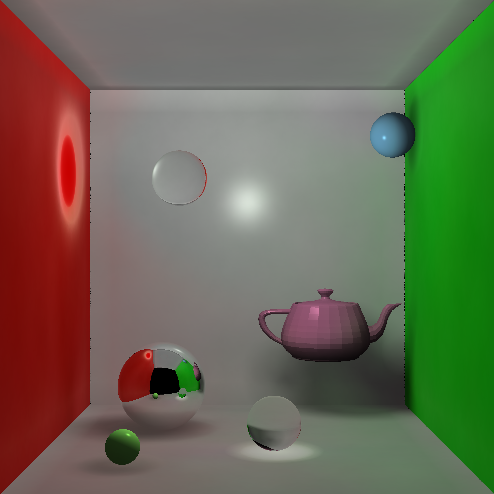

# RayTracing and Photon mapping

Implementation of ray tracing and photon mapping to render 3d objects using C++

## Features

* Ray tracing on:
  * Spheres
  * Rectangles
  * Tiangles
  * Meshes
* Point light
* Phong model
* Cornell box
* Basic shadow implementation using shadow rays (commented out in scene.cpp)
* Refraction
* Reflection
* Photon mapping exhibits:
  * Colour bleeding
  * Better shadow estimation
  * Caustics

## Final Image:

- Image resolution can be modified in main.cpp
- Photon number can be modified in photon_set.cpp
